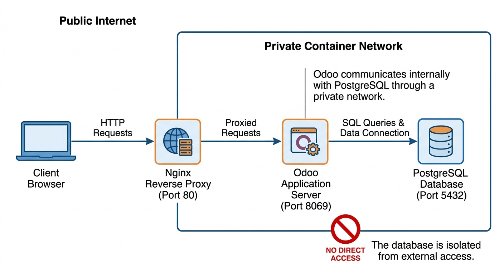

# 🐳 Odoo 17 Docker Deployment with Nginx

This repository provides a minimal **Docker Compose setup** for running **Odoo 17** with **PostgreSQL 15** behind an **Nginx reverse proxy**.

The configuration is designed to be **simple, secure, and easy to deploy** for development or small server environments.

---

# 🏗️ Architecture Overview

The deployment consists of three services orchestrated with Docker Compose:



* **Nginx (Web Server)**
  Public entry point on **port 80** that forwards HTTP requests to Odoo.

* **Odoo (Application Server)**
  Runs **Odoo 17** and connects to PostgreSQL. Application data is stored in a persistent volume.

* **PostgreSQL (Database)**
  **PostgreSQL 15** stores all Odoo application data.

---

# 🚀 Quick Start

## 1. Prerequisites

Ensure the following tools are installed:

* [Git](https://git-scm.com/install)
* [Docker](https://docs.docker.com/engine/install/)
* [Docker Compose](https://docs.docker.com/compose/install/)

---

## 2. Clone the Repository

```bash
git clone https://github.com/dalbanjan-git/odoo-docker.git
cd odoo-docker
```

---

## 3. Configure the Database Password

Create a file that stores the PostgreSQL password used by both Odoo and the database.

```bash
echo "your-secure-password" > odoo_pg_pass
```

**Note:**
The `odoo_pg_pass` file is included in `.gitignore` to prevent credentials from being committed to version control.

---

## 4. Start the Stack

Launch the services:

```bash
docker compose up -d
```

Docker will download the required images and start the containers.

---

## 5. Access Odoo

Open your browser and visit:

```
http://localhost
```

You should see the **Odoo database setup page**.

---

# ⚙️ Configuration

## Reverse Proxy (Nginx)

Nginx listens on **port 80** and forwards traffic to the Odoo application on **port 8069**.

Configuration file:

```
nginx/nginx.conf
```

Responsibilities:

* Accept HTTP requests
* Forward traffic to Odoo
* Preserve client headers (e.g., IP address)

---

## Docker Secrets

The PostgreSQL password is provided using **Docker Secrets**.

```yaml
secrets:
  postgresql_password:
    file: odoo_pg_pass
```

Inside containers the secret is available at:

```
/run/secrets/postgresql_password
```

This avoids exposing passwords in environment variables or configuration files.

---

## Persistent Volumes

Docker volumes ensure data persists even if containers are recreated.

| Volume          | Purpose                   |
| --------------- | ------------------------- |
| `odoo-web-data` | Odoo application data     |
| `odoo-db-data`  | PostgreSQL database files |

---

## Networking

Two Docker networks isolate services.

### `web-network`

Connects:

* Nginx
* Odoo

Handles incoming web traffic.

### `db-network`

Connects:

* Odoo
* PostgreSQL

Marked as **internal**, preventing external access.

---

# 🔧 Useful Commands

Start containers:

```bash
docker compose up -d
```

Stop containers:

```bash
docker compose down
```

View logs:

```bash
docker compose logs -f
```

Restart services:

```bash
docker compose restart
```

---

# 🔐 Security Notes

For production deployments consider adding:

* HTTPS with TLS certificates
* Firewall restrictions
* Automated database backups
* Monitoring and logging

This setup already includes:

* Internal database network isolation
* Secret-based password management
* Persistent storage volumes

---

# ⚖️ License

This project is released under **The Unlicense**, placing it in the public domain.

You may copy, modify, publish, use, compile, sell, or distribute this software for any purpose.

More details:
[https://unlicense.org](https://unlicense.org)
